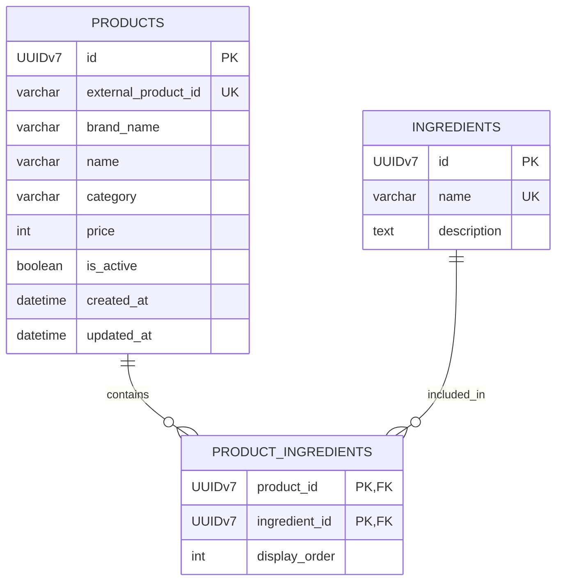
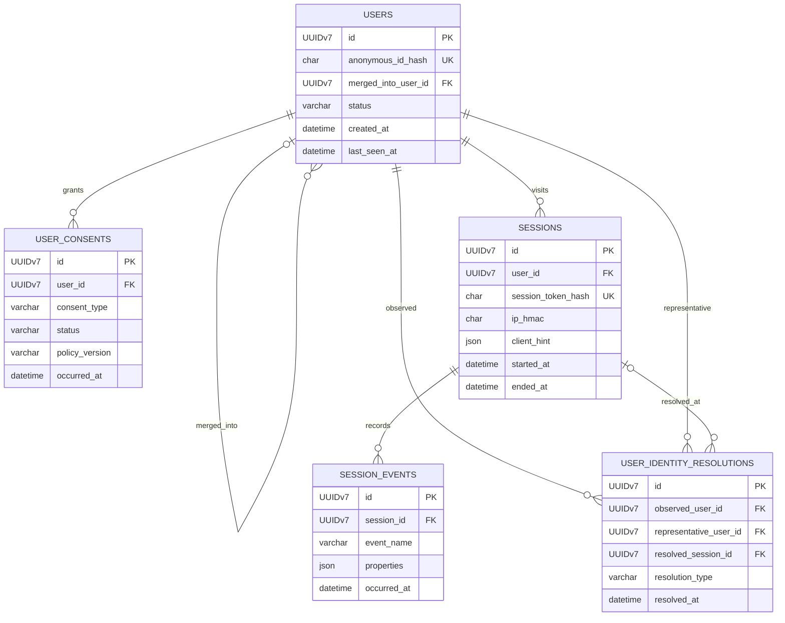
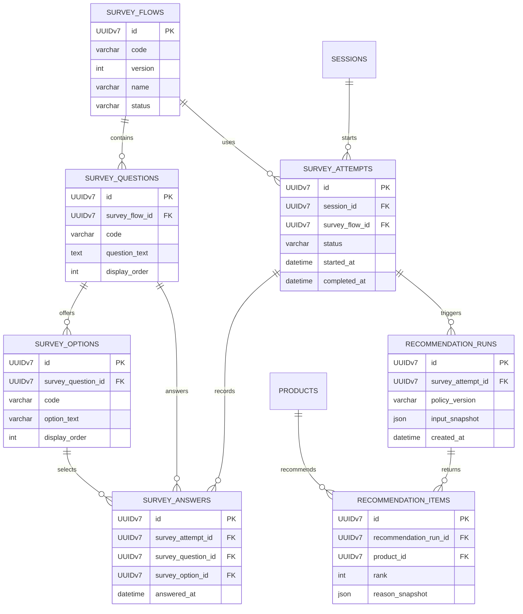

# K-Beauty ERD v2

> 역할: 최소 테이블 관계와 필드 사용법을 정의한다. 데이터 생성·연결 규칙은 [도메인 로직](LOGIC.md), 용어 의미는 [도메인 용어](DOMAIN_TERMS.md)를 따른다.

[개요](README.md) · [도메인 용어](DOMAIN_TERMS.md) · [도메인 로직](LOGIC.md) · [ERD](ERD.md)

## 설계 범위

- 모든 PK·FK는 애플리케이션에서 생성한 `UUIDv7`이며 MySQL에는 `BINARY(16)`으로 저장한다.
- MEMBER 테이블, 가중치, 분석 집계 테이블은 만들지 않는다.
- FK는 기본 `NOT NULL`이며, `users.merged_into_user_id`와 `user_identity_resolutions.resolved_session_id`만 `NULL`을 허용한다.

## 제품 카탈로그

| 테이블.필드 | 타입/제약 | 사용 방법 |
|---|---|---|
| `products.id` | UUIDv7 PK | 제품의 불변 식별자. 모든 제품 참조는 이름 대신 이 값을 쓴다. |
| `products.external_product_id` | VARCHAR(100) NULL UNIQUE | 외부 수집처 상품 ID. 내부 ID를 대체하지 않는다. |
| `products.brand_name` | VARCHAR(100) NULL | 현재 표시할 브랜드명. 별도 브랜드 기준 테이블은 만들지 않는다. |
| `products.name` | VARCHAR(200) NOT NULL | 제품 표시명. 중복을 허용한다. |
| `products.category` | VARCHAR(50) NULL | 토너·세럼처럼 제품을 표시·필터하는 단순 카테고리. |
| `products.description` | TEXT NULL | 운영자가 확인한 제품 설명. |
| `products.price` | INT UNSIGNED NULL | 현재 수집·입력된 KRW 가격. 가격 이력은 이번 범위 밖이다. |
| `products.image_url`, `purchase_url` | VARCHAR(500) NULL | 대표 이미지와 구매 이동 URL. |
| `products.is_active` | BOOLEAN NOT NULL DEFAULT TRUE | 추천·표시 가능 여부. 과거 추천 보존을 위해 삭제 대신 `FALSE`로 바꾼다. |
| `products.created_at`, `updated_at` | DATETIME(6) NOT NULL | 생성·최종 수정 시각. |
| `ingredients.id` | UUIDv7 PK | 성분 식별자. |
| `ingredients.name` | VARCHAR(200) NOT NULL UNIQUE | 정규 성분명. |
| `ingredients.description` | TEXT NULL | 성분 안내 문구. |
| `product_ingredients.product_id`, `ingredient_id` | UUIDv7 PK, FK | 제품과 성분의 복합 PK. 한 제품에 같은 성분을 중복 연결하지 않는다. |
| `product_ingredients.display_order` | INT NOT NULL | 전성분 표시 순서. 추천 점수나 비중이 아니다. |

## USER 기록

| 테이블.필드 | 타입/제약 | 사용 방법 |
|---|---|---|
| `users.id` | UUIDv7 PK | 익명 USER 식별자. |
| `users.anonymous_id_hash` | CHAR(64) NOT NULL UNIQUE | 클라이언트에만 있는 익명 ID의 SHA-256 해시. 같은 해시는 같은 USER를 뜻한다. |
| `users.merged_into_user_id` | UUIDv7 NULL FK → `users.id` | 병합된 USER가 가리키는 대표 USER. `status = MERGED`일 때만 값이 있다. |
| `users.status` | VARCHAR(20) NOT NULL | `ACTIVE`, `MERGED`, `DELETED` 중 하나. |
| `users.created_at`, `last_seen_at` | DATETIME(6) NOT NULL | 최초 생성과 마지막 확인 시각. |
| `user_consents.id` | UUIDv7 PK | 동의 변경 기록의 식별자. |
| `user_consents.user_id` | UUIDv7 NOT NULL FK → `users.id` | 동의를 표시한 USER. |
| `user_consents.consent_type`, `status` | VARCHAR NOT NULL | 초기값은 `BEHAVIOR_STORAGE`, 상태는 `GRANTED`, `DENIED`, `WITHDRAWN`. |
| `user_consents.policy_version`, `occurred_at` | VARCHAR, DATETIME(6) NOT NULL | 동의 정책 버전과 변경 시각. 최신 행을 현재 상태로 본다. |
| `sessions.id` | UUIDv7 PK | 방문 세션 식별자. |
| `sessions.user_id` | UUIDv7 NOT NULL FK → `users.id` | 세션 소유 USER. |
| `sessions.session_token_hash` | CHAR(64) NOT NULL UNIQUE | 짧은 수명 세션 토큰의 해시. 원문은 쿠키에만 둔다. |
| `sessions.ip_hmac` | CHAR(64) NULL | 원문 IP가 아닌 HMAC. USER 병합의 근거로 사용하지 않는다. |
| `sessions.client_hint` | JSON NULL | OS·브라우저 등 파싱된 최소 클라이언트 정보. 원문 User-Agent는 저장하지 않는다. |
| `sessions.started_at`, `ended_at` | DATETIME(6) NOT NULL, NULL | 방문 시작과 종료 시각. |
| `session_events.id` | UUIDv7 PK | 행동 이벤트 식별자이자 중복 기록 방지 키. |
| `session_events.session_id` | UUIDv7 NOT NULL FK → `sessions.id` | 이벤트가 발생한 세션. |
| `session_events.event_name` | VARCHAR(50) NOT NULL | 예: `PAGE_VIEW`, `SURVEY_COMPLETED`, `PRODUCT_CLICKED`. |
| `session_events.properties` | JSON NULL | 화이트리스트 기반 부가 정보. 답변 원문·토큰·IP·원문 User-Agent는 넣지 않는다. |
| `session_events.occurred_at` | DATETIME(6) NOT NULL | 이벤트 발생 시각. |
| `user_identity_resolutions.id` | UUIDv7 PK | USER 연결의 감사 식별자. |
| `user_identity_resolutions.observed_user_id` | UUIDv7 NOT NULL FK → `users.id` | 인증 요청이 발생한 현재 USER. |
| `user_identity_resolutions.representative_user_id` | UUIDv7 NOT NULL FK → `users.id` | MEMBER가 연결한 대표 USER. |
| `user_identity_resolutions.resolved_session_id` | UUIDv7 NULL FK → `sessions.id` | 인증이 일어난 세션. 운영 정정이면 NULL이다. |
| `user_identity_resolutions.resolution_type`, `resolved_at` | VARCHAR, DATETIME(6) NOT NULL | `MEMBER_SIGNUP`, `MEMBER_LOGIN`, `ADMIN_CORRECTION`과 확정 시각. |

## 설문과 추천

| 테이블.필드 | 타입/제약 | 사용 방법 |
|---|---|---|
| `survey_flows.id` | UUIDv7 PK | 설문 버전 식별자. |
| `survey_flows.code`, `version` | VARCHAR(50), INT NOT NULL UNIQUE | 같은 설문의 논리 코드와 버전. 복합 유니크 키를 둔다. |
| `survey_flows.name`, `status` | VARCHAR NOT NULL | 운영용 이름과 `DRAFT`, `PUBLISHED`, `ARCHIVED` 상태. |
| `survey_questions.survey_flow_id` | UUIDv7 NOT NULL FK | 질문이 속한 설문 버전. |
| `survey_questions.code`, `question_text`, `display_order` | VARCHAR, TEXT, INT NOT NULL | 버전 안의 질문 코드·문구·표시 순서. |
| `survey_options.survey_question_id` | UUIDv7 NOT NULL FK | 선택지가 속한 질문. |
| `survey_options.code`, `option_text`, `display_order` | VARCHAR, VARCHAR, INT NOT NULL | 선택지 코드·문구·표시 순서. 초기 버전은 단일 선택만 지원한다. |
| `survey_attempts.session_id`, `survey_flow_id` | UUIDv7 NOT NULL FK | 설문을 진행한 세션과 고정 설문 버전. |
| `survey_attempts.status` | VARCHAR(20) NOT NULL | `IN_PROGRESS`, `COMPLETED`, `ABANDONED`. 추천은 `COMPLETED`만 허용한다. |
| `survey_attempts.started_at`, `completed_at` | DATETIME(6) NOT NULL, NULL | 시도 시작·완료 시각. |
| `survey_answers.survey_attempt_id`, `survey_question_id`, `survey_option_id` | UUIDv7 NOT NULL FK | 한 시도에서 선택한 질문·선택지. `UNIQUE(survey_attempt_id, survey_question_id)`를 둔다. |
| `survey_answers.answered_at` | DATETIME(6) NOT NULL | 답변 확정 시각. |
| `recommendation_runs.survey_attempt_id` | UUIDv7 NOT NULL FK | 결과의 입력이 된 완료 설문. |
| `recommendation_runs.policy_version` | VARCHAR(50) NOT NULL | 추천 규칙 버전. 가중치나 계산식은 저장하지 않는다. |
| `recommendation_runs.input_snapshot` | JSON NOT NULL | 실행 당시 선택지 코드 스냅샷. |
| `recommendation_items.recommendation_run_id`, `product_id` | UUIDv7 NOT NULL FK | 추천 실행과 결과 제품. |
| `recommendation_items.rank` | INT NOT NULL | 실행 안의 표시 순서. `UNIQUE(recommendation_run_id, rank)`를 둔다. |
| `recommendation_items.reason_snapshot` | JSON NOT NULL | 추천된 이유를 재현하기 위한 근거 스냅샷. |

## 최소 제약과 인덱스

- 조인 테이블 `product_ingredients`는 복합 PK를 사용한다.
- `users.status = 'MERGED'`이면 `merged_into_user_id`는 필수이며 자기 참조·순환 병합을 금지한다.
- `user_identity_resolutions`에서 서로 다른 USER를 병합하는 행은 observed USER당 하나만 허용한다.
- `sessions(user_id, started_at)`, `session_events(session_id, occurred_at)`, `survey_attempts(session_id, status)`, `recommendation_items(recommendation_run_id, rank)` 인덱스를 둔다.
