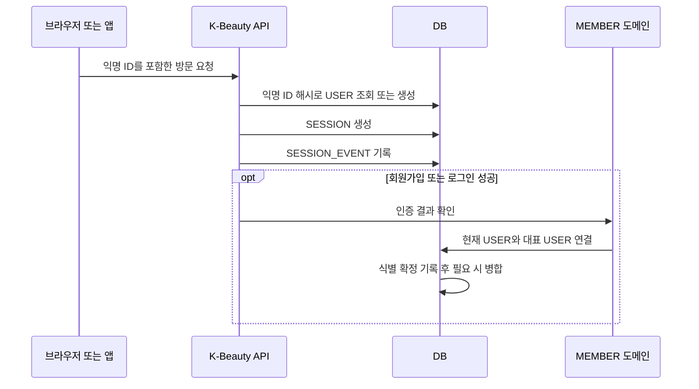

# K-Beauty 도메인 로직 v2

> 역할: [도메인 용어](DOMAIN_TERMS.md)를 기준으로 데이터를 생성·연결·보존하는 규칙을 정의한다. 필드와 FK는 [ERD](ERD.md)에서 관리한다.

[개요](README.md) · [도메인 용어](DOMAIN_TERMS.md) · [도메인 로직](LOGIC.md) · [ERD](ERD.md)

## 범위

비회원 USER의 방문·설문·추천 결과를 남기고, 이후 인증된 MEMBER와 연결할 수 있게 한다. 집계, 마케팅 분석, 어트리뷰션은 범위에 포함하지 않는다.

## 제품과 추천

- 제품은 브랜드명·카테고리·가격 같은 현재 정보와 전성분만 저장한다. 브랜드, 제품 형태, 효능, 특성, 태그를 위한 별도 기준 테이블은 두지 않는다.
- 제품 카테고리는 단순 표시·후보 필터 값이다. 추천 규칙은 애플리케이션 코드에서 관리하며 계산식·가중치 설정을 DB에 저장하지 않는다.
- 완료된 설문에 대해서만 추천 실행을 만들고, 결과 제품·순위·근거 스냅샷을 고정한다. 자연어 설명은 이 스냅샷에서 필요할 때 생성하며 별도 테이블에 저장하지 않는다.
- 과거 추천이 참조하는 제품은 `products.is_active = FALSE`로 숨기고 삭제하지 않는다.

## USER 기록과 연결

1. 첫 방문에서 USER와 익명 ID를 만들고, 서버에는 익명 ID의 해시만 남긴다.
2. 같은 익명 ID로 다시 오면 같은 USER에 새 세션을 연결한다. ID가 없거나 초기화되면 새 USER를 만든다.
3. 세션에는 익명 USER의 방문 시각과 최소한의 IP HMAC·클라이언트 힌트를 남기고, 행동은 이벤트로 기록한다.
4. IP HMAC·클라이언트 힌트만으로 USER를 병합하지 않는다. 회원가입·로그인 또는 검증된 운영 정정만 병합 근거다.
5. MEMBER 인증이 성공하면 현재 USER를 MEMBER가 이미 가진 대표 USER에 연결하고, 원본 세션·이벤트·설문·추천 행은 옮기지 않는다.
6. 로그아웃·계정 전환 때는 클라이언트의 익명 ID를 폐기하고 새 USER를 시작한다.

## 보존 규칙

- `user_consents`의 최신 상태가 허용할 때만 선택적 행동 이벤트를 기록한다. 동의 이력은 덮어쓰지 않는다.
- 원문 IP·User-Agent는 저장하지 않는다. IP는 HMAC만, 클라이언트 정보는 파싱된 최소 힌트만 남긴다.
- 클라이언트와 서버가 같은 행동을 보낼 때는 같은 이벤트 ID를 사용한다.
- 공개된 설문 정의는 수정하지 않고 새 버전을 만든다.
- 병합된 USER의 과거 행을 수정하거나 삭제하지 않는다.

## USER와 MEMBER 연결 계약

1. 인증 요청의 `sessions.user_id`가 현재 USER다.
2. MEMBER 도메인은 MEMBER별 대표 `user_id`를 보관한다.
3. 기존 대표 USER가 있으면 현재 USER를 그 USER에 병합하고, 없으면 현재 USER를 대표 USER로 등록한다.
4. 식별 확정 기록과 USER 병합은 하나의 트랜잭션으로 처리한다.

## 수용 기준

- [ ] 같은 익명 ID 재방문은 기존 USER에 연결된다.
- [ ] 인증된 MEMBER 사건이 없으면 IP·클라이언트 정보만으로 USER가 병합되지 않는다.
- [ ] 설문과 추천 결과는 원래 세션과 USER에 보존된다.
- [ ] 가중치·분석 집계용 테이블이 없다.
