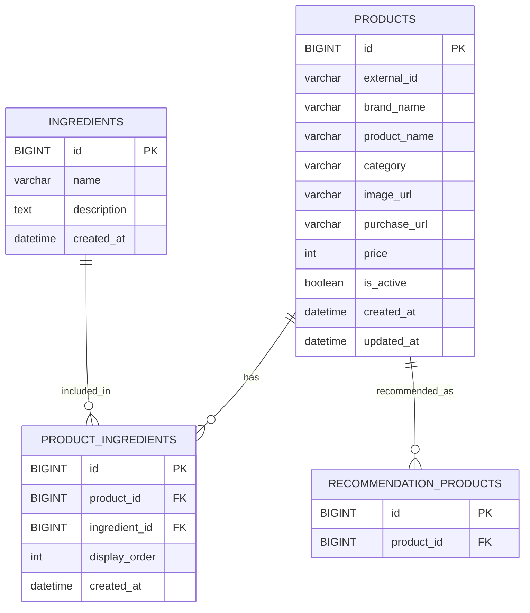

# 제품 도메인 ERD

## 테이블 관계



## 테이블 정의

### products (상품)

| 이름 | 필드명 | 타입 | 제약 | 설명 |
|---|---|---|---|---|
| 상품 ID | `id` | BIGINT | PK | 상품 식별자 |
| 외부 상품 ID | `external_id` | VARCHAR(100) | UNIQUE | 네이버 쇼핑 API에서 제공하는 상품 ID |
| 브랜드명 | `brand_name` | VARCHAR(50) | NOT NULL | 상품 브랜드명 |
| 상품명 | `product_name` | VARCHAR(100) | NOT NULL | 서비스에서 사용하는 상품명 |
| 카테고리 | `category` | VARCHAR(20) | NOT NULL | TONER / SKIN / SERUM / AMPOULE / ESSENCE / GEL_CREAM / MOISTURE_CREAM / NUTRIENT_DEEP_CREAM |
| 이미지 URL | `image_url` | VARCHAR(500) | NULL | 네이버 쇼핑 API에서 받은 상품 이미지 URL |
| 구매 URL | `purchase_url` | VARCHAR(500) | NULL | 네이버 쇼핑 API에서 받은 상품 구매 URL |
| 가격 | `price` | INT | NULL | 네이버 쇼핑 API에서 받은 최저가 |
| 사용 가능 여부 | `is_active` | BOOLEAN | NOT NULL DEFAULT TRUE | 단종 또는 추천 제외 상품일 경우 FALSE |
| 생성일자 | `created_at` | DATETIME | NOT NULL | 생성 시각 |
| 수정일자 | `updated_at` | DATETIME | NOT NULL | 수정 시각 |

### ingredients (성분)

| 이름 | 필드명 | 타입 | 제약 | 설명 |
|---|---|---|---|---|
| 성분 ID | `id` | BIGINT | PK | 성분 식별자 |
| 성분명 | `name` | VARCHAR(50) | NOT NULL UNIQUE | 추천 매칭에 사용하는 성분명 |
| 설명 | `description` | TEXT | NULL | 관리자용 성분 설명 또는 내부 관리 메모 |
| 생성일자 | `created_at` | DATETIME | NOT NULL | 생성 시각 |

### product_ingredients (상품-성분 중간 테이블)

| 이름 | 필드명 | 타입 | 제약 | 설명 |
|---|---|---|---|---|
| 상품-성분 ID | `id` | BIGINT | PK | 상품-성분 관계 식별자 |
| 상품 ID | `product_id` | BIGINT | NOT NULL FK → products.id | 성분이 포함된 상품 |
| 성분 ID | `ingredient_id` | BIGINT | NOT NULL FK → ingredients.id | 상품에 포함된 성분 |
| 표시 순서 | `display_order` | INT | NULL | 상품 상세 화면에서 대표 성분을 보여줄 순서 |
| 생성일자 | `created_at` | DATETIME | NOT NULL | 생성 시각 |

## 제품 카테고리 기준

| 카테고리 코드 | 의미 | 추천 단계 |
|---|---|---|
| `TONER` | 토너 | 1단계 피부결 정돈 |
| `SKIN` | 스킨 | 1단계 피부결 정돈 |
| `SERUM` | 세럼 | 2단계 집중 케어 |
| `AMPOULE` | 앰플 | 2단계 집중 케어 |
| `ESSENCE` | 에센스 | 2단계 집중 케어 |
| `GEL_CREAM` | 젤 크림 (Gel Cream) | 3단계 보습 마무리 |
| `MOISTURE_CREAM` | 수분 크림 (Moisture Cream) | 3단계 보습 마무리 |
| `NUTRIENT_DEEP_CREAM` | 영양/보습 크림 (Nutrient / Deep Cream) | 3단계 보습 마무리 |

## 피부 고민별 추천 성분 매핑

MVP 단계에서는 `effects`, `ingredient_effects` 테이블을 사용하지 않고, 피부 고민별 추천 성분 목록을 백엔드 코드에서 관리한다.

| 고민 코드 | 고민 / 역할 | 추천 성분 |
|---|---|---|
| `MOISTURE` | 수분 / 보습 | 글리세린, 히알루론산, 저분자 히알루론산, 베타인, 판테놀, 세라마이드, 스쿠알란, 시어버터 |
| `SOOTHING` | 피부 진정 / 민감 / 붉은기 | 병풀추출물, 시카, 어성초추출물, 티트리, 알란토인, 판테놀, 마데카소사이드, 쑥추출물 |
| `BRIGHTENING` | 피부톤 불균형 / 잡티 / 칙칙함 | 나이아신아마이드, 비타민 C, 비타민 C 유도체, 트라넥사믹애씨드, 알부틴 |
| `TEXTURE_PORE` | 피부결 / 모공 / 각질 | AHA, BHA, PHA, 위치하젤, 레티놀, 징크 PCA, 발효성분, 갈락토미세스, 비피다발효용해물, 나이아신아마이드 |
| `ANTI_AGING` | 노화 / 탄력 / 주름 | 레티놀, 펩타이드, 아데노신, 나이아신아마이드, 발효성분, 비피다발효용해물, 세라마이드 |

## 불편 경험별 제외 성분 매핑

MVP 단계에서는 `ingredients.is_caution`처럼 성분 자체를 주의 성분으로 관리하지 않는다. 사용자 불편 경험별로 제외해야 하는 기준이 다르므로, 백엔드 코드에서 제외 성분 목록을 관리한다.

| 설문 코드 | 사용자 선택 | 제외 기준 |
|---|---|---|
| `STINGING_SENSITIVE` | 바를 때 따갑거나 화끈거렸던 제품 | AHA, BHA, PHA, 레티놀, 비타민 C, 비타민 C 유도체, 티트리 포함 상품 제외 |
| `HEAVY_OIL_SENSITIVE` | 오일감이 많은 제품 | 시어버터 또는 스쿠알란 포함 상품 제외 |
| `EXFOLIANT_SENSITIVE` | 각질 케어 제품 AHA/BHA | AHA, BHA, PHA 포함 상품 제외 |

## 추천 후보 선정 방식

- 사용자가 선택한 피부 고민의 추천 성분 목록과 상품의 대표 성분을 비교한다.
- 겹치는 성분이 하나 이상 있는 상품을 추천 후보로 선정한다.
- 사용자가 선택한 불편 경험에 해당하는 제외 성분이 포함된 상품은 추천 후보에서 제외한다.
- 추천 결과는 제품군 기준으로 1단계, 2단계, 3단계에서 각각 상품을 추천한다.

## 추천 이유 생성 방식

효능 테이블이나 성분 설명 필드를 사용하지 않고, 사용자 고민과 매칭 성분을 기반으로 추천 이유를 생성한다.

기본 템플릿:

```text
{고민명} 고민에 맞는 {매칭성분} 성분이 포함되어 있어 추천했어요.
```

예시:

```text
수분 / 보습 고민에 맞는 글리세린, 판테놀, 베타인 성분이 포함되어 있어 추천했어요.
```

## MVP 보류 테이블

### effects, ingredient_effects

`effects` 테이블은 보습, 진정, 미백, 각질 케어, 탄력 등 성분이 가질 수 있는 효능 값을 저장하고, `ingredient_effects` 테이블은 성분과 효능의 관계를 저장하기 위한 구조이다.

다만 MVP 추천 흐름은 `피부 고민 → 추천 성분 → 상품` 구조로 처리한다. 따라서 성분과 효능을 한 번 더 연결하는 테이블은 초기 구현에서는 복잡도를 높일 수 있어 보류한다.

추후 추천 이유를 더 정교하게 제공하거나, 성분별 효능을 관리자 페이지에서 관리해야 하는 경우 다시 도입할 수 있다.

### tags, product_tags

`tags` 테이블은 피부 고민, 피부 타입, 민감 경험, 선호 제품군 등 여러 도메인에서 공통으로 사용할 수 있는 태그 값을 저장하고, `product_tags` 테이블은 상품과 태그를 연결하기 위한 구조이다.

다만 MVP 단계에서는 설문 선택값을 `survey_options.option_code`로 관리하고, 상품 분류는 `products.category`로 관리한다. 상품 추천은 별도 태그 연결이 아니라 상품의 카테고리와 성분 정보를 기반으로 백엔드 추천 로직에서 처리한다.

따라서 `tags`, `product_tags` 테이블은 MVP에서 제외 또는 보류한다.

## 제약 조건

- `products.external_id`는 네이버 쇼핑 API 상품 ID를 저장하며, 동일 상품 중복 저장 여부를 판별하는 기준으로 사용한다.
- `products.category`는 서비스 내부 추천 카테고리 기준으로 관리한다. 네이버 쇼핑 API의 `category3` 값과 반드시 동일하지 않아도 된다.
- `ingredients.name`은 중복 저장되지 않도록 UNIQUE로 관리한다.
- `product_ingredients`는 동일 상품과 동일 성분 조합이 중복 저장되지 않도록 `UNIQUE(product_id, ingredient_id)`로 관리한다.
- `product_ingredients.display_order`는 추천 로직이 아니라 상품 상세 화면의 대표 성분 노출 순서를 위해 사용한다.
- `products.description`, `rating`, `rating_count`, `ingredients.is_caution`은 MVP 단계에서 제외한다.
