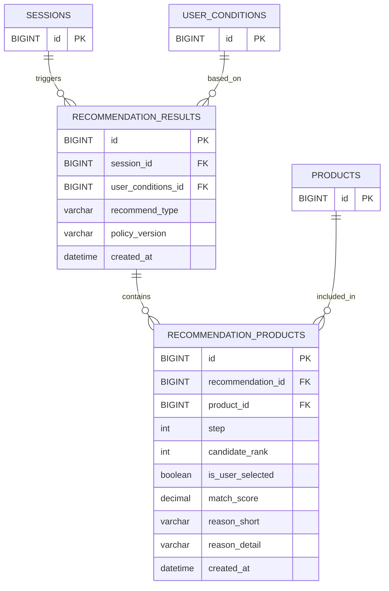

# 추천 도메인 ERD

## 테이블 관계

## 테이블 정의

### recommendation_results (추천 결과)

| 이름 | 필드명 | 타입 | 제약 | 설명 |
|---|---|---|---|---|
| 추천 결과 ID | `id` | BIGINT | PK | 추천 결과 식별자 |
| 세션 ID | `session_id` | BIGINT | NOT NULL FK → sessions.id | 추천이 발생한 세션 |
| 조건 ID | `user_conditions_id` | BIGINT | NOT NULL FK → user_conditions.id | 추천의 근거가 된 진단 조건값 |
| 추천 형태 | `recommend_type` | VARCHAR(20) | NOT NULL | QUICK(빠른 진단) / DETAILED(상세 진단) |
| 추천 규칙 | `policy_version` | VARCHAR(20) | NOT NULL | 추천 규칙 버전 |
| 생성일자 | `created_at` | DATETIME | NOT NULL | 추천 생성 시각 |

### recommendation_products (추천 상품)

| 이름 | 필드명 | 타입 | 제약 | 설명 |
|---|---|---|---|---|
| 추천 상품 ID | `id` | BIGINT | PK | 추천 상품 식별자 |
| 추천 결과 ID | `recommendation_id` | BIGINT | NOT NULL FK → recommendation_results.id | 연결된 추천 결과 |
| 상품 ID | `product_id` | BIGINT | NOT NULL FK → products.id | 추천된 상품 |
| 루틴 단계 | `step` | INT | NOT NULL | 1(피부결 정돈) / 2(집중 케어) / 3(보습 마무리) |
| 후보 순서 | `candidate_rank` | INT | NOT NULL | 1=메인 추천, 2·3=다른 후보 |
| 사용자 교체 여부 | `is_user_selected` | BOOLEAN | NOT NULL DEFAULT FALSE | 사용자가 직접 후보로 교체한 경우 TRUE |
| 매칭 점수 | `match_score` | DECIMAL(5,2) | NULL | 상품 매칭 점수 |
| 이유 보기 | `reason_short` | VARCHAR(200) | NULL | 추천 이유 요약 / 후보 카드 한 줄 설명 |
| 자세한 보기 | `reason_detail` | VARCHAR(1000) | NULL | 자세히 보기 내용 |
| 생성일자 | `created_at` | DATETIME | NOT NULL | 생성 시각 |

## 제약 조건

- 같은 추천 결과 안에서 동일한 단계·후보 순서는 중복될 수 없다. `UNIQUE(recommendation_id, step, candidate_rank)`
- 각 단계의 메인 추천은 `candidate_rank = 1`이며, 후보는 `candidate_rank = 2 또는 3`이다.
- `candidate_rank`는 `match_score` 내림차순으로 결정하며, 동점일 경우 네이버 `productId` 내림차순(더 최근 등록 상품 우선)으로 결정한다.
- `is_user_selected = TRUE`인 상품은 사용자가 후보에서 직접 교체한 상품이다. 답변 변경 시 FALSE로 초기화한다.
