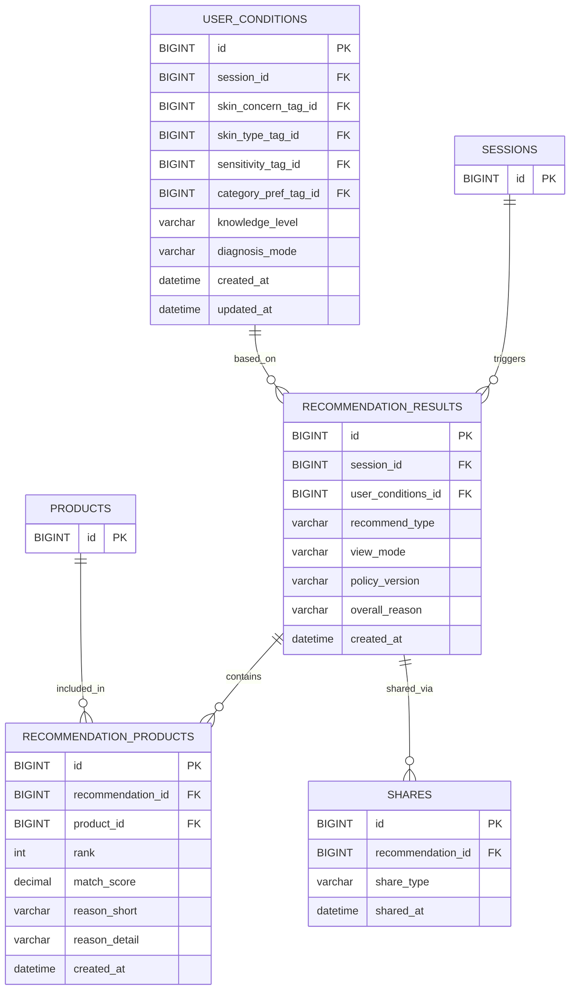

# 추천 도메인 ERD

## 테이블 관계

## 테이블 정의

### recommendation_results (추천 결과)

| 필드 | 타입/제약 | 설명 |
|---|---|---|
| `id` | BIGINT PK | 추천 결과 식별자 |
| `session_id` | BIGINT NOT NULL FK → sessions.id | 추천이 발생한 세션 |
| `user_conditions_id` | BIGINT NOT NULL FK → user_conditions.id | 추천의 근거가 된 진단 조건값 |
| `recommend_type` | VARCHAR(20) NOT NULL | 추천 방식. QUICK / TAG / DETAILED / SCORE 중 하나 |
| `view_mode` | VARCHAR(20) NOT NULL | 보기 모드. 등록보기 / 자세히보기 |
| `policy_version` | VARCHAR(20) NOT NULL | 추천 규칙 버전 |
| `overall_reason` | VARCHAR(255) NULL | 전체 추천 결과에 대한 요약 이유 |
| `created_at` | DATETIME NOT NULL | 추천 생성 시각 |

### recommendation_products (추천 상품)

| 필드 | 타입/제약 | 설명 |
|---|---|---|
| `id` | BIGINT PK | 추천 상품 식별자 |
| `recommendation_id` | BIGINT NOT NULL FK → recommendation_results.id | 연결된 추천 결과 |
| `product_id` | BIGINT NOT NULL FK → products.id | 추천된 상품 |
| `rank` | INT NOT NULL | 추천 순위 (1 / 2 / 3) |
| `match_score` | DECIMAL(5,2) NULL | 상품 매칭 점수 |
| `reason_short` | VARCHAR(200) NULL | 이 상품을 추천한 요약 이유 |
| `reason_detail` | VARCHAR(1000) NULL | 이 상품을 추천한 상세 이유 |
| `created_at` | DATETIME NOT NULL | 생성 시각 |

### shares (공유)

| 필드 | 타입/제약 | 설명 |
|---|---|---|
| `id` | BIGINT PK | 공유 식별자 |
| `recommendation_id` | BIGINT NOT NULL FK → recommendation_results.id | 공유된 추천 결과 |
| `share_type` | VARCHAR(20) NOT NULL | 공유 방식. KAKAO / LINK / TEXT 중 하나 |
| `shared_at` | DATETIME NOT NULL | 공유 시각 |

## 제약 조건

- `recommendation_products`의 순위는 같은 추천 결과 안에서 중복될 수 없다. `UNIQUE(recommendation_id, rank)`
- 공유 기능은 `shares` 테이블로 일원화한다. `recommendation_results`에 공유 관련 필드를 두지 않는다.
