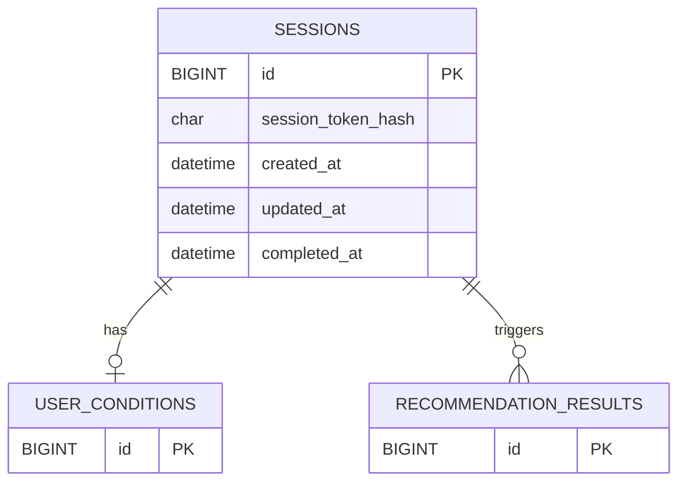

# 세션 도메인 ERD

## 테이블 관계

## 테이블 정의

### sessions (세션)

| 이름 | 필드명 | 타입 | 제약 | 설명 |
|---|---|---|---|---|
| 세션 ID | `id` | BIGINT | PK | 세션 식별자 |
| 세션 토큰 해시 | `session_token_hash` | CHAR(64) | NOT NULL UNIQUE | 세션 토큰의 SHA-256 해시값. 토큰 원본은 클라이언트 쿠키에만 보관 |
| 생성일자 | `created_at` | DATETIME | NOT NULL | 세션 시작 시각 |
| 수정일자 | `updated_at` | DATETIME | NOT NULL | 세션 마지막 갱신 시각 |
| 종료일자 | `completed_at` | DATETIME | NULL | 세션 종료 시각. 진행 중이면 NULL |

## 제약 조건

- 세션은 사용자가 온보딩을 시작할 때 생성된다.
- `처음부터 다시 하기` 선택 시 기존 세션의 `completed_at`을 현재 시각으로 갱신하고 새 세션을 생성한다.
- `completed_at`이 NULL인 세션이 활성 세션이다.
