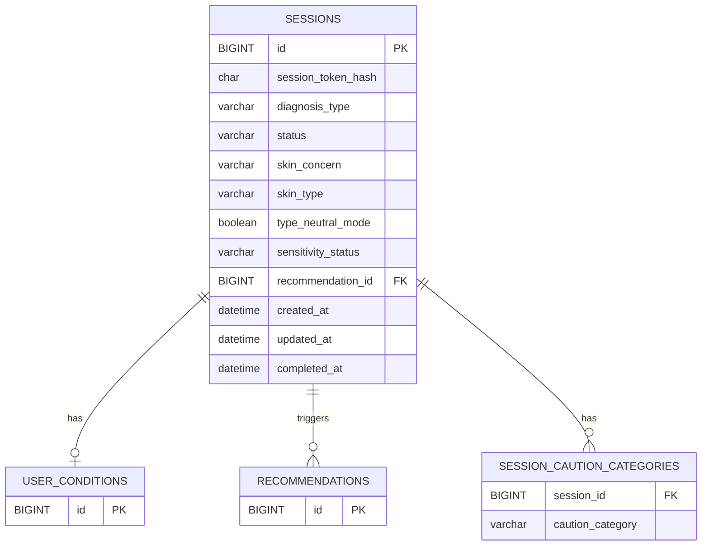

# 세션 도메인 ERD

## 테이블 관계

## 테이블 정의

### sessions (세션)

| 이름 | 필드명 | 타입 | 제약 | 설명 |
|---|---|---|---|---|
| 세션 ID | `id` | BIGINT | PK | 세션 식별자 |
| 세션 토큰 해시 | `session_token_hash` | CHAR(64) | NOT NULL UNIQUE | 세션 토큰의 SHA-256 해시값. 토큰 원본은 클라이언트 쿠키에만 보관 |
| 진단 경로 | `diagnosis_type` | VARCHAR(20) | NULL | QUICK(빠른 진단) / DETAILED(상세 진단). 경로 선택 전 NULL |
| 상태 | `status` | VARCHAR(20) | NOT NULL | IN_PROGRESS / COMPLETED / RESTARTED |
| 피부 고민 | `skin_concern` | VARCHAR(20) | NULL | MOISTURE / TONE / SENSITIVE / AGING / TROUBLE |
| 피부 타입 | `skin_type` | VARCHAR(20) | NULL | DRY / OILY / COMBINATION / DEHYDRATED_OILY / UNKNOWN |
| 타입 중립 모드 | `type_neutral_mode` | BOOLEAN | NOT NULL DEFAULT FALSE | 피부 타입을 모르겠어요 선택 후 이대로 추천받기 시 TRUE |
| 민감도 상태 | `sensitivity_status` | VARCHAR(20) | NOT NULL DEFAULT UNASSESSED | UNASSESSED / LOW / MEDIUM / HIGH |
| 최신 추천 ID | `recommendation_id` | BIGINT | NULL FK → recommendations.id | 현재 세션의 최신 유효 추천 결과 |
| 생성일자 | `created_at` | DATETIME | NOT NULL | 세션 시작 시각 |
| 수정일자 | `updated_at` | DATETIME | NOT NULL | 세션 마지막 갱신 시각 |
| 종료일자 | `completed_at` | DATETIME | NULL | 세션 종료 시각. 진행 중이면 NULL |

### session_caution_categories (세션 주의 카테고리)

| 이름 | 필드명 | 타입 | 제약 | 설명 |
|---|---|---|---|---|
| 세션 ID | `session_id` | BIGINT | NOT NULL FK → sessions.id | 연결된 세션 |
| 주의 카테고리 | `caution_category` | VARCHAR(20) | NOT NULL | FRAGRANCE / ALCOHOL / OIL / EXFOLIANT / UNKNOWN |

## 제약 조건

- 세션은 사용자가 온보딩을 시작할 때 생성된다.
- `처음부터 다시 하기` 선택 시 기존 세션의 `completed_at`을 현재 시각으로 갱신하고 새 세션을 생성한다.
- `completed_at`이 NULL인 세션이 활성 세션이다.
- `sensitivity_status` 기본값은 `UNASSESSED`이며, 빠른 진단 경로에서는 Survey-1을 거치지 않으므로 변경되지 않는다.
- `type_neutral_mode`가 TRUE인 경우 `skin_type`은 UNKNOWN으로 저장된다.
