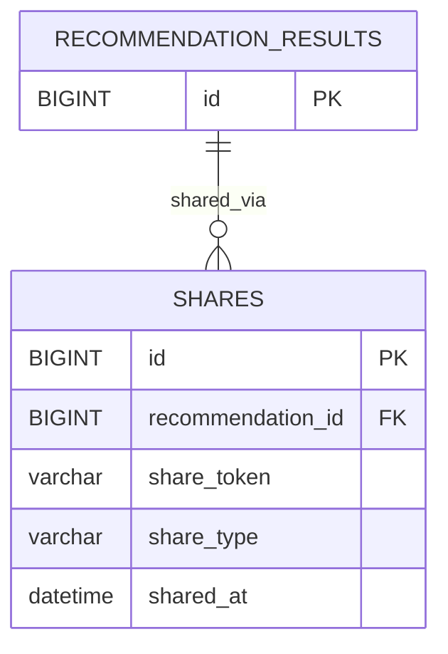

# 공유 도메인 ERD

## 테이블 관계

## 테이블 정의

### shares (공유)

| 이름 | 필드명 | 타입 | 제약 | 설명 |
|---|---|---|---|---|
| 공유 ID | `id` | BIGINT | PK | 공유 식별자 |
| 추천 결과 ID | `recommendation_id` | BIGINT | NOT NULL FK → recommendation_results.id | 공유된 추천 결과 |
| 공유 토큰 | `share_token` | VARCHAR(100) | NOT NULL UNIQUE | 공유 링크 접근용 토큰. `/share/{share_token}` 형태로 사용 |
| 공유 방식 | `share_type` | VARCHAR(20) | NOT NULL | KAKAO / LINK / TEXT |
| 공유 시간 | `shared_at` | DATETIME | NOT NULL | 공유 시각 |

## 제약 조건

- 공유 기능은 `shares` 테이블로 일원화한다. `recommendation_results`에 공유 관련 필드를 두지 않는다.
- `share_token`은 공유 생성 시 서버에서 발급하며, `/share/{share_token}` 형태로 접근한다.
