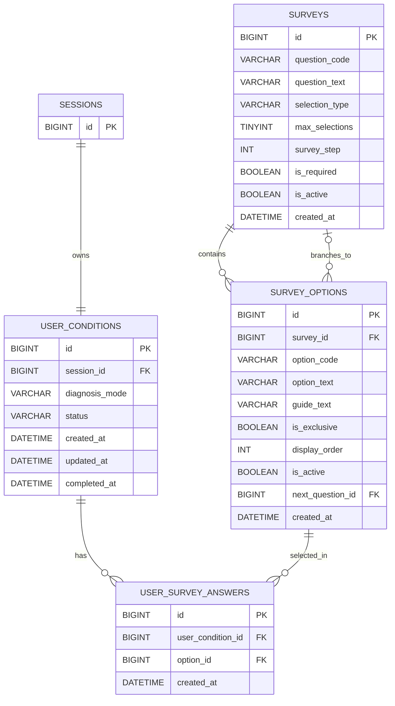

# 설문 도메인 ERD

## 테이블 관계

## 테이블 정의

### surveys(설문 정보)

| 이름 | 칼럼명 | 타입 | 제약 | 설명 |
|---|---|---|---|---|
| 질문 ID | `id` | BIGINT | PK | 설문 질문을 식별하는 고유 ID |
| 질문 코드 | `question_code` | VARCHAR(30) | NOT NULL, UNIQUE | 질문의 의미와 백엔드 분기 로직을 식별하는 고정 코드 |
| 질문 문구 | `question_text` | VARCHAR(200) | NOT NULL | 사용자 화면에 노출되는 질문 문구 |
| 선택 방식 | `selection_type` | VARCHAR(10) | NOT NULL | `SINGLE`(단일 선택), `MULTIPLE`(복수 선택) |
| 최대 선택 수 | `max_selections` | TINYINT | NOT NULL | 해당 질문에서 선택 가능한 최대 선택지 수 |
| 설문 단계 | `survey_step` | INT | NOT NULL, UNIQUE | 전체 설문 흐름에서의 질문 순서. Q1~Q5에 해당 |
| 필수 여부 | `is_required` | BOOLEAN | NOT NULL, DEFAULT TRUE | 추천 생성 전 반드시 답변해야 하는 질문인지 여부 |
| 활성 여부 | `is_active` | BOOLEAN | NOT NULL, DEFAULT TRUE | 현재 사용자에게 노출하는 질문인지 여부 |
| 생성일자 | `created_at` | DATETIME | NOT NULL, DEFAULT CURRENT_TIMESTAMP | 질문 마스터 데이터 생성 시각 |                                                                       |

#### 질문 데이터
| 설문 단계 | 질문 코드 | 질문 |
|---:|---|---|
| 1 | `CONCERN` | 어떤 고민이 가장 큰가요? |
| 2 | `SKIN_TYPE` | 현재 피부 타입은 어떻게 되나요? |
| 3 | `SENSITIVITY` | 새로운 제품 사용 시 예민해지나요? |
| 4 | `CAUTION` | 어떤 제품이 불편했나요? |
| 5 | `EXPLORATION_HABIT` | 성분이나 리뷰를 찾아보나요? |

### survey_options(설문 선택지 정보)

| 이름 | 칼럼명 | 타입 | 제약 | 설명 |
|---|---|---|---|---|
| 선택지 ID | `id` | BIGINT | PK | 설문 선택지를 식별하는 고유 ID |
| 질문 ID | `survey_id` | BIGINT | NOT NULL, FK | 선택지가 속한 설문 질문 ID |
| 옵션 코드 | `option_code` | VARCHAR(50) | NOT NULL | 추천 도메인과 연동하는 선택지의 고정 시스템 코드 |
| 옵션 문구 | `option_text` | VARCHAR(100) | NOT NULL | 사용자 화면에 보여주는 선택지 문구 |
| 가이드 문구 | `guide_text` | VARCHAR(300) | NULL | 피부 타입 가이드 바텀시트 등에 노출하는 보조 설명 |
| 단독 선택 여부 | `is_exclusive` | BOOLEAN | NOT NULL, DEFAULT FALSE | 이 선택지를 고르면 같은 질문의 다른 선택지를 함께 고를 수 없는지 여부 |
| 표시 순서 | `display_order` | INT | NOT NULL | 하나의 질문 안에서 선택지를 화면에 표시하는 순서 |
| 활성 여부 | `is_active` | BOOLEAN | NOT NULL, DEFAULT TRUE | 현재 사용자에게 노출하는 선택지인지 여부 |
| 다음 질문 ID | `next_question_id` | BIGINT | NULL, FK | 현재 선택지 선택 후 조건부로 이동할 다음 질문 ID |
| 생성일자 | `created_at` | DATETIME | NOT NULL, DEFAULT CURRENT_TIMESTAMP | 선택지 마스터 데이터 생성 시각 |                                             |

#### option_code가 가지는 값
| 질문 | 코드 예시 |
|---|---|
| Q1 핵심 고민 | `MOISTURE`, `TONE`, `SENSITIVE`, `AGING`, `TROUBLE` |
| Q2 피부 타입 | `DRY`, `OILY`, `COMBINATION`, `DEHYDRATED_OILY`, `UNKNOWN` |
| Q3 민감 여부 | `SENSITIVE_YES`, `SENSITIVE_NO` |
| Q4 주의 카테고리 | `FRAGRANCE`, `ALCOHOL`, `OILY_TEXTURE`, `EXFOLIATION`, `CAUTION_UNKNOWN` |
| Q5 탐색 습관 | `FREQUENTLY`, `OCCASIONALLY`, `RARELY` |

### user_survey_answers(사용자 응답 정보)

| 이름      | 필드명                 | 타입       | 제약                                  | 설명                          |
| ------- | ------------------- | -------- | ----------------------------------- | --------------------------- |
| 답변 ID   | `id`                | BIGINT   | PK                                  | 사용자 설문 답변 식별자               |
| 컨텍스트 ID | `user_condition_id` | BIGINT   | NOT NULL FK → user\_conditions.id   | 답변이 속한 세션별 설문 진행 컨텍스트 ID    |
| 선택지 ID  | `option_id`         | BIGINT   | NOT NULL FK → survey\_options.id    | 사용자가 선택한 설문 선택지 ID; 실제 응답 값 |
| 생성일자    | `created_at`        | DATETIME | NOT NULL DEFAULT CURRENT\_TIMESTAMP | 사용자가 해당 선택지를 저장한 시각         |

### user_conditions(사용자 설문 진행 정보)

| 이름 | 칼럼명 | 타입 | 제약 | 설명 |
|---|---|---|---|---|
| 설문 진행 ID | `id` | BIGINT | PK | 한 번의 설문 진행을 식별하는 고유 ID |
| 세션 ID | `session_id` | BIGINT | NOT NULL, UNIQUE, FK | 익명 사용자의 세션 ID. 세션당 하나의 설문 진행 정보를 연결 |
| 진단 방식 | `diagnosis_mode` | VARCHAR(20) | NULL | `QUICK`, `DETAILED` 중 선택한 진단 경로. Q1·Q2 진행 중에는 아직 경로를 선택하지 않았으므로 `NULL` |
| 설문 상태 | `status` | VARCHAR(20) | NOT NULL, DEFAULT `IN_PROGRESS` | `IN_PROGRESS`(진행 중), `COMPLETED`(완료), `ABANDONED`(중단) 상태 |
| 생성일자 | `created_at` | DATETIME | NOT NULL, DEFAULT CURRENT_TIMESTAMP | 설문 진행 정보를 생성한 시각 |
| 수정일자 | `updated_at` | DATETIME | NOT NULL, 자동 갱신 | 설문 답변·경로·상태가 마지막으로 수정된 시각 |
| 완료일자 | `completed_at` | DATETIME | NULL | 빠른 진단 또는 상세 진단의 필수 응답을 완료한 시각 |

## 제약 조건

* 같은 설문 진행 컨텍스트 내에서 동일한 선택지는 중복 선택할 수 없다. UNIQUE(user_condition_id, option_id)
* 각 질문의 메인 선택지는 display_order = 1이며, 후속 선택지는 display_order >= 2 순으로 표시된다.
* is_active = FALSE인 질문과 선택지는 사용자에게 노출되지 않는다. 설문 진행 시 활성 상태를 필터링해야 한다.
* 설문 분기 기능은 survey_options 테이블의 next_question_id로 일원화한다. surveys에 별도의 분기 관련 필드를 두지 않는다.
* 설문 상태는 IN_PROGRESS → COMPLETED 또는 ABANDONED 순으로만 전환된다. 완료 또는 중단된 설문은 상태를 되돌릴 수 없다.

### 질문 선택 규칙
| 질문 | 규칙 |
|---|---|
| `CONCERN` | 단일 선택 |
| `SKIN_TYPE` | 단일 선택 |
| `SENSITIVITY` | 단일 선택 |
| `CAUTION` | 복수 선택 가능 |
| `EXPLORATION_HABIT` | 단일 선택 |

### 민감도상태 계산 규칙
| 조건 | 계산 결과 |
|---|---|
| 빠른 진단으로 Q3 미응답 | `UNASSESSED` |
| Q3 = `SENSITIVE_NO` | `LOW` |
| Q3 = `SENSITIVE_YES` + Q4 1개 선택 | `MEDIUM` |
| Q3 = `SENSITIVE_YES` + `CAUTION_UNKNOWN` 선택 | `MEDIUM` |
| Q3 = `SENSITIVE_YES` + Q4 2개 이상 선택 | `HIGH` |

### 유니크키 제약 
| 제약명                                       | 대상 테이블                | 컬럼                               | 설명                                  |
| ----------------------------------------- | --------------------- | -------------------------------- | ----------------------------------- |
| `uq_user_conditions_session`              | `user_conditions`     | `session_id`                     | 같은 세션당 설문 진행 컨텍스트는 1개만 존재           |
| `uq_surveys_survey_step`                  | `surveys`             | `survey_step`                    | 같은 설문 단계를 중복 생성하지 않음                 |
| `uq_surveys_question_code`                | `surveys`             | `question_code`                  | 질문 코드는 설문 조사 전역에서 고유                  |
| `uq_survey_options_code`                  | `survey_options`      | `survey_id`, `option_code`       | 같은 질문 내에서 옵션 코드는 중복 불가              |
| `uq_user_survey_answers_condition_option` | `user_survey_answers` | `user_condition_id`, `option_id` | 같은 설문 진행 컨텍스트 내에서 동일한 선택지는 중복 선택 불가 |

### 외래키 제약
| 제약명                                | 대상 테이블                | 컬럼                  | 참조 테이블            | 참조 컬럼 | 설명                           |
| ---------------------------------- | --------------------- | ------------------- | ----------------- | ----- | ---------------------------- |
| `fk_user_conditions_session`       | `user_conditions`     | `session_id`        | `sessions`        | `id`  | 설문 진행 정보의 세션 참조                        |
| `fk_survey_options_survey`         | `survey_options`      | `survey_id`         | `surveys`         | `id`  | 선택지가 속한 질문 참조                        |
| `fk_survey_options_next_question`  | `survey_options`      | `next_question_id`  | `surveys`         | `id`  | 분기 대상 질문 참조; NULL이면 기본 순서 따름 |
| `fk_user_survey_answers_condition` | `user_survey_answers` | `user_condition_id` | `user_conditions` | `id`  | 답변이 속한 설문 진행 정보 참조                |
| `fk_user_survey_answers_option`    | `user_survey_answers` | `option_id`         | `survey_options`  | `id`  | 사용자가 선택한 선택지 참조                       |

