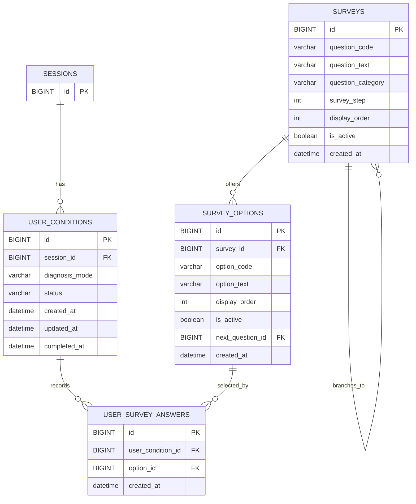

# 설문 도메인 ERD

## 테이블 관계

## 테이블 정의

### surveys(설문 정보)

| 이름    | 필드명                 | 타입           | 제약                                  | 설명                                                                              |
| ----- | ------------------- | ------------ | ----------------------------------- | ------------------------------------------------------------------------------- |
| 질문 ID | `id`                | BIGINT       | PK                                  | 설문 질문 식별자                                                                       |
| 질문 코드 | `question_code`     | VARCHAR(30)  | NOT NULL UNIQUE                     | 추천 로직에서 사용하는 고정 질문 코드: CONCERN, SKIN\_TYPE, SENSITIVITY, KNOWLEDGE\_LEVEL       |
| 질문 문구 | `question_text`     | VARCHAR(200) | NOT NULL                            | 사용자 화면에 노출되는 질문 문구                                                              |
| 질문 분류 | `question_category` | VARCHAR(30)  | NOT NULL                            | CONCERN(피부 고민) / SKIN\_TYPE(피부 타입) / SENSITIVITY(민감도) / KNOWLEDGE\_LEVEL(지식 수준) |
| 설문 단계 | `survey_step`       | INT          | NOT NULL                            | 설문 화면 표시 단계                                                                     |
| 표시 순서 | `display_order`     | INT          | NOT NULL                            | 같은 단계 내 질문 표시 순서                                                                |
| 활성 여부 | `is_active`         | BOOLEAN      | NOT NULL DEFAULT TRUE               | 운영 중 사용자에게 노출할 질문인지 여부                                                          |
| 생성일자  | `created_at`        | DATETIME     | NOT NULL DEFAULT CURRENT\_TIMESTAMP | 질문 생성 시각                                                                        |

### survey_options(설문 선택지 정보)

| 이름       | 필드명                | 타입           | 제약                                  | 설명                                                    |
| -------- | ------------------ | ------------ | ----------------------------------- | ----------------------------------------------------- |
| 선택지 ID   | `id`               | BIGINT       | PK                                  | 설문 선택지 식별자                                            |
| 질문 ID    | `survey_id`        | BIGINT       | NOT NULL FK → surveys.id            | 선택지가 속한 설문 질문 ID                                      |
| 옵션 코드    | `option_code`      | VARCHAR(50)  | NOT NULL                            | 추천 도메인 연동용 고정 코드: DRY, TIGHTNESS, ALCOHOL, BEGINNER 등 |
| 옵션 문구    | `option_text`      | VARCHAR(100) | NOT NULL                            | 사용자 화면에 표시되는 선택지 문구                                   |
| 표시 순서    | `display_order`    | INT          | NOT NULL                            | 질문 내 선택지 표시 순서                                        |
| 활성 여부    | `is_active`        | BOOLEAN      | NOT NULL DEFAULT TRUE               | 운영 중 사용자에게 노출할 선택지인지 여부                               |
| 다음 질문 ID | `next_question_id` | BIGINT       | NULL FK → surveys.id                | 조부 분기 시 다음 질문 ID; NULL이면 기본 설문 순서를 따름                |
| 생성일자     | `created_at`       | DATETIME     | NOT NULL DEFAULT CURRENT\_TIMESTAMP | 선택지 생성 시각                                             |

### user_survey_answers(사용자 응답 정보)

| 이름      | 필드명                 | 타입       | 제약                                  | 설명                          |
| ------- | ------------------- | -------- | ----------------------------------- | --------------------------- |
| 답변 ID   | `id`                | BIGINT   | PK                                  | 사용자 설문 답변 식별자               |
| 컨텍스트 ID | `user_condition_id` | BIGINT   | NOT NULL FK → user\_conditions.id   | 답변이 속한 세션별 설문 진행 컨텍스트 ID    |
| 선택지 ID  | `option_id`         | BIGINT   | NOT NULL FK → survey\_options.id    | 사용자가 선택한 설문 선택지 ID; 실제 응답 값 |
| 생성일자    | `created_at`        | DATETIME | NOT NULL DEFAULT CURRENT\_TIMESTAMP | 사용자가 해당 선택지를 저장한 시각         |

### user_conditions(사용자 설문 진행 정보)

| 이름      | 필드명              | 타입          | 제약                                                               | 설명                                                 |
| ------- | ---------------- | ----------- | ---------------------------------------------------------------- | -------------------------------------------------- |
| 컨텍스트 ID | `id`             | BIGINT      | PK                                                               | 설문 진행 컨텍스트 식별자                                     |
| 세션 ID   | `session_id`     | BIGINT      | NOT NULL FK → sessions.id                                        | 익명 사용자 세션 ID; 세션당 설문 컨텍스트 1개                       |
| 진단 방식   | `diagnosis_mode` | VARCHAR(20) | NOT NULL                                                         | QUICK(빠른 진단) / DETAILED(상세 진단)                     |
| 설문 상태   | `status`         | VARCHAR(20) | NOT NULL DEFAULT 'IN\_PROGRESS'                                  | IN\_PROGRESS(진행 중) / COMPLETED(완료) / ABANDONED(중단) |
| 생성일자    | `created_at`     | DATETIME    | NOT NULL DEFAULT CURRENT\_TIMESTAMP                              | 설문 시작 시각                                           |
| 수정일자    | `updated_at`     | DATETIME    | NOT NULL DEFAULT CURRENT\_TIMESTAMP ON UPDATE CURRENT\_TIMESTAMP | 설문 컨텍스트 최종 수정 시각                                   |
| 완료일자    | `completed_at`   | DATETIME    | NULL                                                             | 필수 설문 응답이 완료된 시각                                   |

## 제약 조건

* 같은 설문 진행 컨텍스트 내에서 동일한 선택지는 중복 선택할 수 없다. UNIQUE(user_condition_id, option_id)
* 각 질문의 메인 선택지는 display_order = 1이며, 후속 선택지는 display_order >= 2 순으로 표시된다.
* is_active = FALSE인 질문과 선택지는 사용자에게 노출되지 않는다. 설문 진행 시 활성 상태를 필터링해야 한다.
* 설문 분기 기능은 survey_options 테이블의 next_question_id로 일원화한다. surveys에 별도의 분기 관련 필드를 두지 않는다.
* 설문 상태는 IN_PROGRESS → COMPLETED 또는 ABANDONED 순으로만 전환된다. 완료 또는 중단된 설문은 상태를 되돌릴 수 없다.

### 유니크키 제약 
| 제약명                                       | 대상 테이블                | 컬럼                               | 설명                                  |
| ----------------------------------------- | --------------------- | -------------------------------- | ----------------------------------- |
| `uq_user_conditions_session`              | `user_conditions`     | `session_id`                     | 같은 세션당 설문 진행 컨텍스트는 1개만 존재           |
| `uq_surveys_question_code`                | `surveys`             | `question_code`                  | 질문 코드는 설문 조사 전역에서 고유                  |
| `uq_survey_options_code`                  | `survey_options`      | `survey_id`, `option_code`       | 같은 질문 내에서 옵션 코드는 중복 불가              |
| `uq_user_survey_answers_condition_option` | `user_survey_answers` | `user_condition_id`, `option_id` | 같은 설문 진행 컨텍스트 내에서 동일한 선택지는 중복 선택 불가 |

### 외래키 제약
| 제약명                                | 대상 테이블                | 컬럼                  | 참조 테이블            | 참조 컬럼 | 설명                           |
| ---------------------------------- | --------------------- | ------------------- | ----------------- | ----- | ---------------------------- |
| `fk_user_conditions_session`       | `user_conditions`     | `session_id`        | `sessions`        | `id`  | 세션 참조                        |
| `fk_survey_options_survey`         | `survey_options`      | `survey_id`         | `surveys`         | `id`  | 질문 참조                        |
| `fk_survey_options_next_question`  | `survey_options`      | `next_question_id`  | `surveys`         | `id`  | 분기 대상 질문 참조; NULL이면 기본 순서 따름 |
| `fk_user_survey_answers_condition` | `user_survey_answers` | `user_condition_id` | `user_conditions` | `id`  | 설문 진행 컨텍스트 참조                |
| `fk_user_survey_answers_option`    | `user_survey_answers` | `option_id`         | `survey_options`  | `id`  | 선택지 참조                       |

